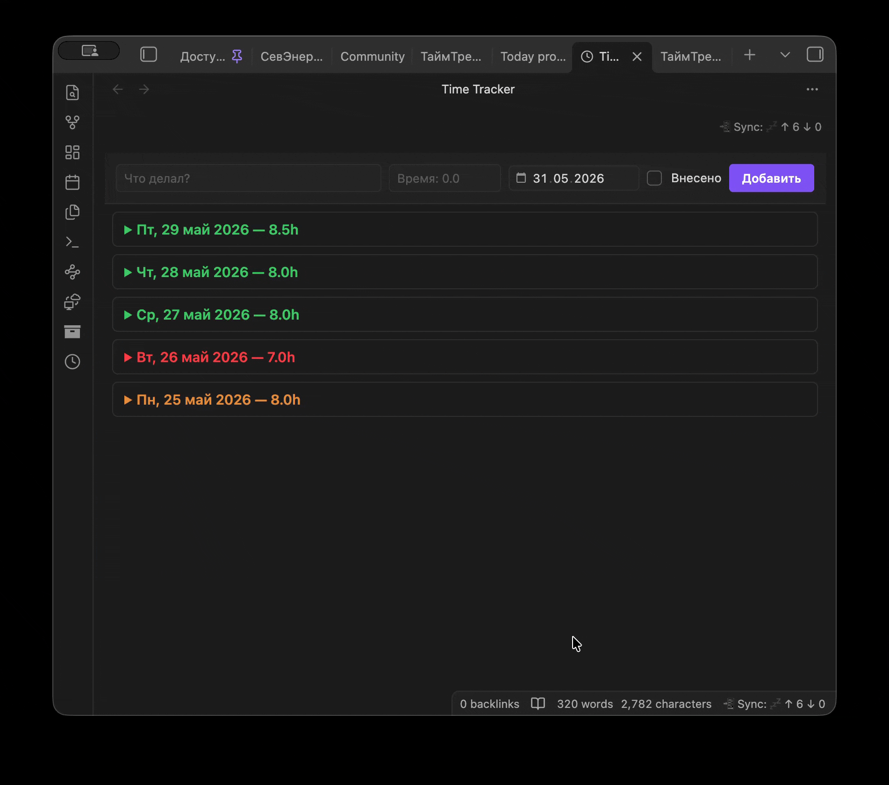

# Time Tracker

Плагин для учёта времени в Obsidian.



## Возможности

- **Форма** — текстовое описание, время (формат `1`, `1.5`, `2.5`), дата (выбор календарём), чекбокс «Внесено»
- **Группировка по дням** — записи сгруппированы по датам, внутри дня от новых к старым
- **Спойлеры** — текущий день открыт, прошлые дни свёрнуты, можно раскрыть/закрыть любой день
- **Цветовая индикация** для прошедших дней:
  - 🔴 красный — суммарное время меньше 7.5h
  - 🟠 оранжевый — суммарное время ≥ 7.5h, но не все записи отмечены
  - 🟢 зелёный — суммарное время ≥ 7.5h и все записи отмечены
- **Редактирование** — клик на тексте или времени записи, Enter сохранить, Escape отменить
- **Удаление** — кнопка ✕
- **Добавление записей за прошлые даты** — выбор даты в форме

## Установка

### Вручную

1. Скачай из [releases](https://github.com/ваш-username/obsidian-time-tracker/releases) архив либо скопируй файлы `main.js`, `manifest.json`, `styles.css` вручную
2. Помести их в папку `<хранилище>/.obsidian/plugins/obsidian-time-tracker/`
3. В Obsidian: **Настройки → Community plugins → Обновить список** → включи **Time Tracker**

### Через BRAT

1. Установи плагин [BRAT](https://obsidian.md/plugins?id=obsidian42-brat)
2. `BRAT → Add Beta plugin → Вставь URL репозитория`
3. Обнови список плагинов, включи **Time Tracker**

## Как пользоваться

1. Нажми на иконку часов в левой панели или выполни команду `Open Time Tracker`
2. Заполни форму:
   - **Что делал?** — описание задачи
   - **Время** — число без букв: `1`, `1.5`, `2.5`
   - **Дата** — по умолчанию сегодня, можно выбрать любую
   - **Внесено** — отметка что время учтено
3. Нажми **Добавить** (синяя кнопка) или Enter
4. Редактирование: раскрой день, кликни по тексту или времени
5. Удаление: ✕ справа от записи

## Синхронизация

Сами думайте) Я себе синхронизирую через селфхост решение: https://github.com/vrtmrz/obsidian-livesync

## Разработка

```bash
npm install      # установка зависимостей
npm run dev      # режим разработки (watch)
npm run build    # production-сборка
```

Требуется Node.js 18+.

## Структура файлов

```
obsidian-time-tracker/
├── main.ts        # исходный код
├── manifest.json  # метаданные плагина
├── styles.css     # стили
├── package.json
├── tsconfig.json
├── esbuild.config.mjs
└── main.js        # скомпилированный bundle
```
